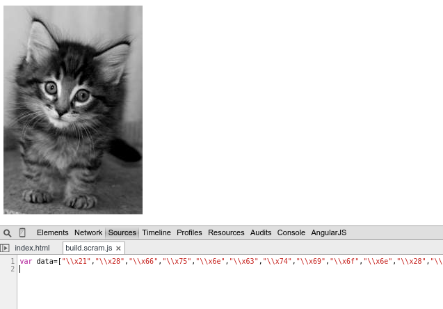

# scram

> Scramble your Javascript

## Getting Started
This plugin requires Grunt.

If you haven't used [Grunt](http://gruntjs.com/) before, be sure to check out the [Getting Started](http://gruntjs.com/getting-started) guide, as it explains how to create a [Gruntfile](http://gruntjs.com/sample-gruntfile) as well as install and use Grunt plugins. Once you're familiar with that process, you may install this plugin with this command:

```shell
npm install scram --save-dev
```

Once the plugin has been installed, it may be enabled inside your Gruntfile with this line of JavaScript:

```js
grunt.loadNpmTasks('scram');
```

## The "scram" task

### Overview
In your project's Gruntfile, add a section named `scram` to the data object passed into `grunt.initConfig()`.

```js
grunt.initConfig({
  scram: {
    options: {},
    build: {
      "./build/app.scram.min.js" : ["./build/app.min.js"],
    },
  },
})
```

### Options

#### options.src `String`
File you wish to scramble

#### options.dest `String`
File thats the scrambled result

### Usage Examples

Let's take an arbitrary piece of code in your build at `app.js`:

```js
!(function(w,d) {
    var img = d.createElement("img");
    img.src = "http://placekitten.com/g/200/300";

    var body = document.querySelector("body");
    body.appendChild(img);
}(this, this.document));
```

Now we add it to our Grunt task `scram`:

```js
grunt.initConfig({
  scram: {
    options: {},
    files: {
      "./build/app.scram.js" : ["./app.js"],
    },
  },
})
```

The contents may look like this then:

```js
var data=
["\\x21","\\x28","\\x66","\\x75","\\x6e","\\x63",
/* some more hex... */
"\\x74","\\x29","\\x29","\\x3b","\\x0a"];
var x=""; data.forEach(function(s){x += String.fromCharCode(parseInt(s.substr(2), 16));}); eval(x)
```

And we add it to our page:

```html
<!DOCTYPE html>
<html>
  <head>
    <meta charset="utf-8"/>
    <title></title>
    <meta name="description" content=""/>
    <meta name="viewport" content="width=device-width"/>
  </head>
  <body>
    <script src="build/build.scram.js" type="text/javascript"></script>
  </body>
</html>
```

Aaand we have kittens!



#### Default Options

Here we simply set a destination file we want to scramble the script into. If it self bootsraps even better. The script will go through eval() to get it working.

```js
grunt.initConfig({
  scram: {
    options: {},
    files: {
      "./build/app.scram.min.js" : ["./build/app.min.js"],
    },
  },
})
```

## Contributing
In lieu of a formal styleguide, take care to maintain the existing coding style. Add unit tests for any new or changed functionality. Lint and test your code using [Grunt](http://gruntjs.com/).

## Release History
_(Nothing yet)_

## License
Copyright (c) 2014 Andreas Marschke. Licensed under the MIT license.
